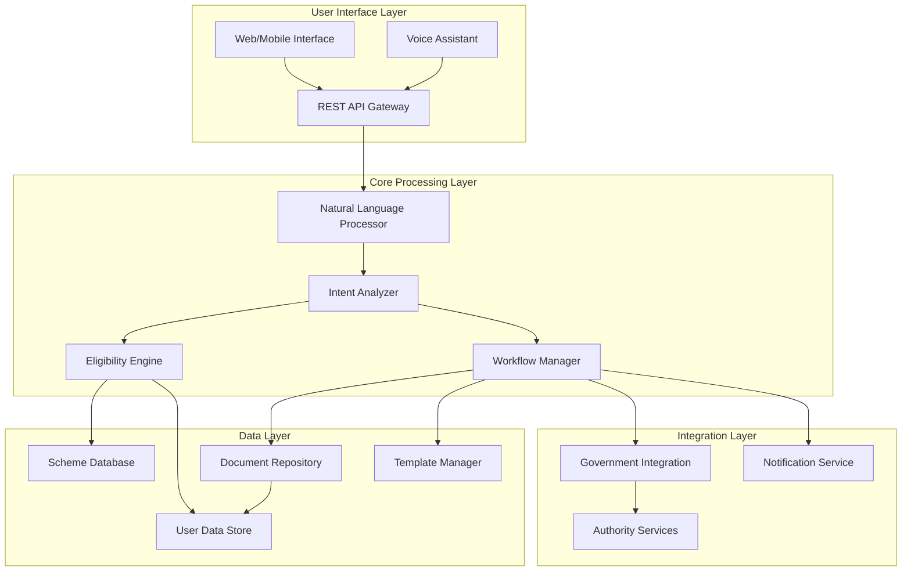

# Design Document: Indian Digital Assistant

## Overview

The Indian Digital Assistant is a comprehensive AI-powered platform that serves as a unified digital gateway for people of Indian origin to access government schemes and documentation services. The system leverages natural language processing, machine learning, and intelligent workflow orchestration to democratize access to India's complex administrative landscape.

The platform operates as a conversational AI that can understand user intent from natural language queries, evaluate eligibility across thousands of schemes, and guide users through complete documentation workflows. It integrates with government systems where possible while maintaining a seamless user experience that abstracts away bureaucratic complexity.

## Architecture

The system follows a microservices architecture with clear separation of concerns:



The architecture ensures scalability through horizontal scaling of stateless services, with data persistence handled by dedicated storage services. The system maintains clear boundaries between user-facing services, business logic, and external integrations.

## Components and Interfaces

### Natural Language Processor (NLP)
**Purpose**: Converts user input (text/voice) into structured data for processing
**Key Functions**:
- Speech-to-text conversion with Indian language support
- Intent extraction from natural language queries
- Entity recognition for schemes, documents, and user context
- Language detection and translation services

**Interfaces**:
```typescript
interface NLPService {
  processQuery(input: string | AudioBuffer, language?: string): ProcessedQuery
  extractEntities(text: string): EntityCollection
  detectLanguage(input: string): LanguageCode
  translateText(text: string, targetLanguage: LanguageCode): string
}

interface ProcessedQuery {
  intent: IntentType
  entities: EntityCollection
  confidence: number
  language: LanguageCode
  clarificationNeeded: boolean
}
```

### Intent Analyzer
**Purpose**: Determines user goals and maps them to appropriate system actions
**Key Functions**:
- Analyzes processed queries to understand user objectives
- Identifies documentation pathways based on user goals
- Generates clarifying questions when intent is ambiguous
- Maintains conversation context across multiple interactions

**Interfaces**:
```typescript
interface IntentAnalyzer {
  analyzeIntent(query: ProcessedQuery, context: ConversationContext): IntentAnalysis
  generateClarification(analysis: IntentAnalysis): ClarificationQuestion[]
  updateContext(context: ConversationContext, newInfo: UserResponse): ConversationContext
}

interface IntentAnalysis {
  primaryIntent: IntentType
  confidence: number
  requiredDocuments: DocumentType[]
  eligibleSchemes: SchemeCategory[]
  nextSteps: ActionStep[]
}
```

### Eligibility Engine
**Purpose**: Evaluates user qualification for schemes and suggests alternatives
**Key Functions**:
- Assesses user eligibility against scheme criteria
- Ranks schemes by relevance and benefit potential
- Suggests alternative schemes when primary options aren't available
- Maintains real-time eligibility calculations

**Interfaces**:
```typescript
interface EligibilityEngine {
  evaluateEligibility(userProfile: UserProfile, schemes: Scheme[]): EligibilityResult[]
  findAlternativeSchemes(rejectedScheme: Scheme, userProfile: UserProfile): Scheme[]
  rankSchemes(schemes: Scheme[], userProfile: UserProfile): RankedScheme[]
}

interface EligibilityResult {
  scheme: Scheme
  eligible: boolean
  confidence: number
  missingCriteria: Criterion[]
  estimatedBenefit: number
}
```

### Workflow Manager
**Purpose**: Orchestrates end-to-end processes for schemes and documentation
**Key Functions**:
- Creates unified workflows combining multiple requirements
- Tracks progress across concurrent applications
- Manages document dependencies and reuse
- Coordinates with external authority systems

**Interfaces**:
```typescript
interface WorkflowManager {
  createWorkflow(requirements: Requirement[], userProfile: UserProfile): Workflow
  executeStep(workflowId: string, stepId: string, input: StepInput): StepResult
  trackProgress(workflowId: string): WorkflowStatus
  manageDocumentReuse(documents: Document[], newRequirements: Requirement[]): ReuseStrategy
}

interface Workflow {
  id: string
  steps: WorkflowStep[]
  dependencies: StepDependency[]
  status: WorkflowStatus
  estimatedCompletion: Date
}
```

### Document Repository
**Purpose**: Securely stores and manages user documents and templates
**Key Functions**:
- Encrypted storage of user documents
- Version control and validity tracking
- Template management for official forms
- Access control and audit logging

**Interfaces**:
```typescript
interface DocumentRepository {
  storeDocument(document: Document, userId: string): DocumentId
  retrieveDocument(documentId: DocumentId, userId: string): Document
  validateDocument(document: Document, requirements: ValidationRules): ValidationResult
  getTemplate(documentType: DocumentType): DocumentTemplate
}

interface Document {
  id: DocumentId
  type: DocumentType
  content: EncryptedContent
  metadata: DocumentMetadata
  validityPeriod: DateRange
  verificationStatus: VerificationStatus
}
```

### Government Integration Service
**Purpose**: Interfaces with official government systems and portals
**Key Functions**:
- Direct submission to government portals where APIs exist
- Status tracking for submitted applications
- Authentication and authorization with government systems
- Fallback to manual processes when automation isn't available

**Interfaces**:
```typescript
interface GovernmentIntegration {
  submitApplication(application: Application, targetAuthority: Authority): SubmissionResult
  trackApplicationStatus(submissionId: string): ApplicationStatus
  authenticateWithAuthority(authority: Authority, credentials: AuthCredentials): AuthToken
  getAuthorityContacts(authority: Authority, location: Location): ContactInfo[]
}

interface SubmissionResult {
  success: boolean
  submissionId: string
  acknowledgmentNumber?: string
  nextSteps: ActionStep[]
  estimatedProcessingTime: Duration
}
```

## Data Models

### Core User Data
```typescript
interface UserProfile {
  id: UserId
  personalInfo: PersonalInformation
  location: LocationDetails
  preferences: UserPreferences
  eligibilityCache: EligibilityCache
  documentPortfolio: DocumentPortfolio
}

interface PersonalInformation {
  name: string
  dateOfBirth: Date
  gender: Gender
  nationality: string
  identityNumbers: IdentityDocument[]
  contactInfo: ContactInformation
}

interface LocationDetails {
  currentAddress: Address
  permanentAddress: Address
  state: StateCode
  district: DistrictCode
  pincode: string
}
```

### Scheme and Documentation Models
```typescript
interface Scheme {
  id: SchemeId
  name: string
  description: string
  authority: Authority
  eligibilityCriteria: Criterion[]
  benefits: Benefit[]
  applicationProcess: ProcessStep[]
  documents: RequiredDocument[]
  lastUpdated: Date
}

interface Criterion {
  type: CriterionType
  field: string
  operator: ComparisonOperator
  value: any
  weight: number
}

interface DocumentType {
  id: DocumentTypeId
  name: string
  category: DocumentCategory
  issuingAuthority: Authority
  validityPeriod: Duration
  prerequisites: DocumentType[]
  template: DocumentTemplate
}
```

### Workflow and Process Models
```typescript
interface WorkflowStep {
  id: StepId
  name: string
  type: StepType
  requirements: Requirement[]
  estimatedDuration: Duration
  canBeAutomated: boolean
  authorityInteractionRequired: boolean
}

interface Requirement {
  type: RequirementType
  description: string
  mandatory: boolean
  documents: DocumentType[]
  validationRules: ValidationRule[]
}
```

## Error Handling

The system implements comprehensive error handling across all layers:

### User-Facing Error Handling
- **Graceful Degradation**: When AI services are unavailable, the system falls back to structured forms and predefined workflows
- **Clear Error Messages**: All errors are translated into user-friendly language with suggested next steps
- **Alternative Pathways**: When automated processes fail, users are provided with manual alternatives including contact information

### System-Level Error Handling
- **Circuit Breakers**: Prevent cascade failures when external services (government portals) are unavailable
- **Retry Logic**: Automatic retry with exponential backoff for transient failures
- **Fallback Services**: Backup processing capabilities for critical functions like eligibility evaluation

### Data Integrity Protection
- **Transaction Management**: All multi-step processes use distributed transactions to ensure consistency
- **Validation Layers**: Multiple validation checkpoints prevent invalid data from propagating through the system
- **Audit Logging**: Complete audit trail for all data modifications and system actions

## Testing Strategy

The testing approach combines comprehensive unit testing with property-based testing to ensure system reliability:

### Unit Testing Focus
- **Component Integration**: Test interactions between NLP, Intent Analyzer, and Eligibility Engine
- **Edge Cases**: Handle malformed inputs, network failures, and data inconsistencies
- **Authority Integration**: Mock external government services to test integration logic
- **Security Validation**: Verify encryption, access controls, and data protection measures

### Property-Based Testing Approach
Property-based testing will validate universal correctness properties using a minimum of 100 iterations per test. Each test will be tagged with the format: **Feature: indian-digital-assistant, Property {number}: {property_text}**

The testing framework will use appropriate property-based testing libraries for the chosen implementation language, focusing on:
- **Data Consistency**: Ensure user data remains consistent across all operations
- **Eligibility Logic**: Verify eligibility calculations are deterministic and correct
- **Workflow Integrity**: Validate that workflows maintain proper state transitions
- **Security Properties**: Ensure encryption and access controls work correctly across all scenarios

Both unit tests and property tests are complementary and necessary for comprehensive coverage. Unit tests catch specific integration issues and edge cases, while property tests verify that the system behaves correctly across the full range of possible inputs and scenarios.

## Correctness Properties

*A property is a characteristic or behavior that should hold true across all valid executions of a system—essentially, a formal statement about what the system should do. Properties serve as the bridge between human-readable specifications and machine-verifiable correctness guarantees.*

Based on the prework analysis and property reflection to eliminate redundancy, the following properties validate the system's correctness:

### Property 1: Natural Language Processing Robustness
*For any* text or voice input in supported languages, the system should process the input without errors and extract meaningful intent information, regardless of completeness, formality, or regional variations.
**Validates: Requirements 1.1, 1.2, 1.4, 1.5**

### Property 2: Comprehensive Scheme Search Coverage  
*For any* user query related to benefits or assistance, the search results should include schemes from all government levels (Central, State, Local) and non-governmental programs relevant to the query.
**Validates: Requirements 2.1**

### Property 3: Deterministic Eligibility Evaluation
*For any* identical combination of user profile and scheme criteria, the eligibility evaluation should always produce the same result, and ineligible users should always receive alternative scheme suggestions.
**Validates: Requirements 2.2, 2.3, 2.4**

### Property 4: Universal Documentation Support
*For any* documentation need described by a user, the system should identify specific required documents, their issuing authorities, prerequisites, and dependencies, regardless of document category.
**Validates: Requirements 3.1, 3.2, 3.3, 3.4**

### Property 5: Goal-Based Pathway Inference
*For any* user goal or situation description, the system should infer appropriate documentation pathways and present multiple options with explanations when alternatives exist.
**Validates: Requirements 4.1, 4.2, 4.3**

### Property 6: Document Lifecycle Management
*For any* user document, the system should enable reuse across applications, maintain version control and validity tracking, and ensure secure encrypted storage with proper access controls.
**Validates: Requirements 5.2, 5.4, 6.5, 10.1, 10.2**

### Property 7: Comprehensive Workflow State Tracking
*For any* active workflow or submitted application, the system should maintain complete progress tracking, dependency management, and real-time status updates.
**Validates: Requirements 5.3, 6.4**

### Property 8: Document Validation and Submission Integrity
*For any* uploaded document, the system should validate completeness and format against requirements, and ready applications should always be submitted directly without external redirects.
**Validates: Requirements 6.2, 6.3**

### Property 9: Authority Interaction Support
*For any* process requiring official interaction, the system should identify the requirement with explanations, provide complete contact details, and offer escalation mechanisms when issues arise.
**Validates: Requirements 7.1, 7.2, 7.4**

### Property 10: Unified Priority Processing
*For any* user request, the system should allow priority classification, provide expedited pathways for urgent requests, prioritize appointment scheduling, and maintain separate processing workflows for different priority levels.
**Validates: Requirements 8.1, 8.2, 8.4, 8.5**

### Property 11: Accessibility and Language Consistency
*For any* user with low literacy levels, the system should provide voice-first interactions, and for any terminology, translations should be consistent across all supported languages.
**Validates: Requirements 9.2, 9.5**

### Property 12: Data Privacy and Consent Management
*For any* data sharing with authorities, the system should obtain explicit user consent and maintain audit logs, and for any deletion request, should permanently remove personal information while preserving anonymized analytics.
**Validates: Requirements 10.3, 10.4**

### Property 13: Graceful Error Handling
*For any* system error or high load condition, the system should provide clear error messages with alternative pathways and maintain functionality through graceful degradation rather than complete failure.
**Validates: Requirements 11.3, 11.5**

### Property 14: Comprehensive Documentation Guidance
*For any* document creation request, the system should provide step-by-step guidance including format requirements, mandatory fields, supporting documents, and validation criteria.
**Validates: Requirements 12.1, 12.2**

### Property 15: Authentic Government Portal Integration
*For any* required government portal interaction, the system should provide authentic official links, pre-filled forms when possible, navigation guidance, and workflow integration upon return.
**Validates: Requirements 12.3, 12.4, 12.5, 12.7**

### Property 16: Change Management and Version Control
*For any* change in documentation requirements or scheme information, the system should update templates immediately, notify affected users, maintain complete version history, and prioritize official sources when conflicts exist.
**Validates: Requirements 13.2, 13.4, 13.5**
